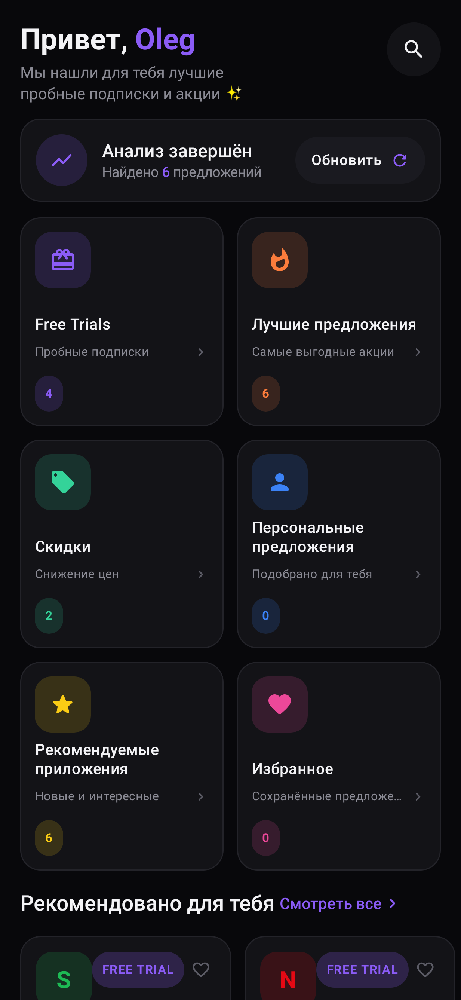
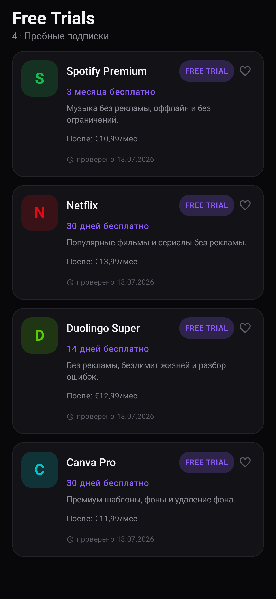
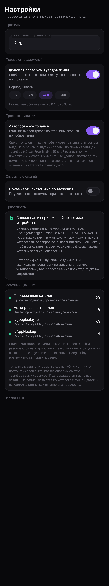

# Триалы — трекер акций и пробных подписок

Android-приложение, которое находит на устройстве приложения из своего каталога и
показывает для них **пробные подписки (free trial)** и **скидки**. Пробные подписки
всегда приоритетнее обычных акций.

Kotlin · Jetpack Compose · Material 3 · Room · WorkManager · OkHttp · Coil · kotlinx.serialization

<p align="center">
  
  
  
</p>

## APK

Готовый к установке APK лежит в [`artifacts/trial-tracker-1.0.0.apk`](artifacts/trial-tracker-1.0.0.apk)
(minSdk 26, targetSdk 35). Подписан debug-ключом — для установки нужно разрешить
установку из неизвестных источников. Перед публикацией в Play замените
`signingConfig` на настоящий keystore и включите R8 (`isMinifyEnabled = true`).

## Что внутри

### 1. Сканирование установленных приложений
`data/PackageScanner.kt` — по одному пакету через `getApplicationInfo()` в try/catch.

Разрешение **`QUERY_ALL_PACKAGES` не запрашивается**: Google Play строго проверяет
его обоснование и может отклонить приложение. В `<queries>` объявлены пакеты
каталога плюс запрос по launcher-интенту — это задокументированная Google
альтернатива, и без неё нельзя сопоставить свежую акцию из фида, пакет которой
заранее неизвестен. Системные приложения по умолчанию скрыты, переключатель — в
настройках.

### 2. Источники данных

Три источника, они дополняют друг друга: фиды дают скидки, автопроверка — сроки
триалов, каталог закрывает то, что подтвердить не удалось.

#### 2a. Живой парсинг публичных фидов (скидки)

**Скидки Google Play публикуются непрерывно**, и Reddit отдаёт каждый сабреддит как Atom-фид. Это документированный
публичный интерфейс, поэтому парсится он, а не HTML Play Store (нарушение ToS) и не
сторонние промо-страницы (нестабильно).

| Фид | URL |
|-----|-----|
| r/googleplaydeals | `https://www.reddit.com/r/googleplaydeals/new/.rss?limit=100` |
| r/AppHookup | `https://www.reddit.com/r/AppHookup/new/.rss?limit=100` |

Конвейер (`data/parse/`):

1. `AtomFeedParser` — потоковый разбор `<entry>` через `XmlPullParser`.
2. `DealTitleParser` — из заголовка достаются старая и новая цена. Формат люди пишут
   руками, поэтому парсер держит все встреченные варианты:
   `($29.99 -> $1.99)` · `($2.99 -> Free)` · `{ $0.99 > $0.86}` · `($.99 -> $.39)` ·
   `($13,99->$5,60)` · `[Games]Без пробела`. Заголовок без распознаваемого перехода
   цены **отбрасывается** — неверная цена хуже отсутствующей.
3. `RedditDealMapper` — из тела поста берётся `package_name` ссылки на Play (ключ
   сопоставления с устройством), из времени поста — `last_verified_date` (здесь она
   точная, а не проставленная руками), из превью поста — иконка приложения.
   Посты-подборки и посты с несколькими пакетами отбрасываются.

На живом фиде из 100 записей разбирается 99; единственная пропущенная —
пост про два приложения сразу. Тесты гоняются на реальном ответе, сохранённом в
`app/src/test/resources/googleplaydeals_sample.xml`.

Источники независимы: если фид недоступен или отдал 429, его прошлые записи
остаются в базе, а не стираются — приложение деградирует до «слегка устаревших
данных», а не до пустого экрана. Статус каждого источника виден в настройках.

#### 2b. Автопроверка триалов

Машиночитаемого источника с триалами не существует — это проверено, а не
предположено:

| Что проверял | Результат |
|--------------|-----------|
| Описание в листинге Google Play | **1 из 20** — почти все «находки» оказались текстом отзывов, а не описанием разработчика; ISO-8601 данных о подписке на странице нет. Плюс автоматический доступ к Play запрещён его же условиями |
| Фиды r/googleplaydeals, r/AppHookup | только снижение цен платных приложений, триалов нет |
| RSS Slickdeals по запросу «free trial» | запрос игнорируется, отдаётся общая лента товаров |

Зато сам сервис пишет срок триала словами на своей странице тарифов. Это и
парсится (`TrialTextExtractor` + `TrialProbeSource`):

* берутся `deep_link` из каталога и `/pricing`, `/plans`, `/premium` того же
  домена — первая страница, где нашёлся срок, выигрывает;
* теги схлопываются, но `<script>` **не** вырезается: у SPA текст живёт именно
  в JSON-блобе (без этого находилось 5 из 20 вместо 8);
* распознаются `7-day Free Trial`, `Try 14-days free`, `free for 30 days`,
  `First 30 days free`, `30 дней бесплатно`, `пробный период 7 дней`; недели и
  месяцы приводятся к дням;
* если страница рекламирует несколько сроков, побеждает самый частый, при
  равенстве — меньший: завысить триал хуже, чем занизить;
* отсеиваются шаблоны (`{{number}}-day trial`), напоминания
  («2 days before trial ends») и годовые планы.

Отдельное правило против самого частого ложного срабатывания: «3 months of
free», «6 months FREE» — это бонус к годовой подписке, а не триал. Всё длиннее
62 дней принимается, только если страница сама называет это trial / пробным
периодом. На живом прогоне это отсеяло ExpressVPN (90 дней) и Freeletics (180).

**Покрытие — 27 из 80** сервисов базы подтверждаются автоматически. Остальные
рисуют число на клиенте, поэтому остаются с ручной датой или ждут в watchlist.
Подтверждённое помечается в карточке зелёной галочкой и `Проверка:
автоматически` вместе с фразой, из которой взят срок, — видно, чему верить.
Проверка ограничена: не чаще раза в сутки на запись, максимум 12 страниц за
запуск, и в первую очередь проверяются приложения, установленные у пользователя.

Тесты гоняются на реальном тексте страниц
(`app/src/test/resources/vendor_page_snippets.json`), включая два сервиса без
триала — чтобы ловить ложные срабатывания.

#### 2c. Каталог и watchlist

**80 сервисов**: 41 предложение (37 триалов + 6 скидок) и 39 сервисов в
`watchlist` — тех, у кого предложение пока не подтверждено.

Watchlist — это то, как база растёт без релиза: приложение само проверяет эти
страницы тарифов на устройстве и переводит сервис в триалы, как только тот
объявит предложение. Установленные у пользователя приложения проверяются первыми.

Каталог отдаётся по HTTP и обновляется без релиза:

* `catalog/deals.json` — источник (GitHub Pages / raw.githubusercontent /
  Firebase Hosting);
* `app/src/main/assets/deals_catalog.json` — та же копия внутри APK, чтобы первый
  запуск работал офлайн;
* адрес источника — в `BuildConfig.CATALOG_URL`, виден в настройках.

Поля: `package_name`, `app_name`, `title`, `type` (`trial`/`discount`), `duration`,
`description`, `price_after`, `discount_percent`, `deep_link`, `last_verified_date`,
`brand_color`, `icon_url`, `glyph`, `popularity`, плюс проставляемые приложением
`verified_by` (`manual`/`auto`), `evidence` и `evidence_url`.

**`last_verified_date` показывается в UI везде**, где видно предложение — условия
акций отличаются по регионам и быстро устаревают.

Состав: музыка и видео (Spotify, YouTube, Netflix, Disney+, Max, Hulu,
Paramount+, Peacock, Crunchyroll, Plex, Apple Music, Amazon Music, Tidal,
Deezer, SoundCloud, Audible, Яндекс Музыка, Кинопоиск, Иви), продуктивность
(Notion, Evernote, Todoist, Trello, Asana, Slack, Zoom, Dropbox, Google One,
Microsoft 365), пароли и VPN (1Password, Bitwarden, LastPass, Dashlane,
NordVPN, ExpressVPN, Surfshark, Proton), обучение (Duolingo, Babbel, Busuu,
Rosetta Stone, Coursera, Udemy, Skillshare, Brilliant, Blinkist), дизайн и фото
(Canva, Picsart, Lightroom, VSCO, Facetune, Remini, CapCut, InShot, KineMaster),
спорт и здоровье (Strava, Headspace, Calm, MyFitnessPal, Nike, Freeletics,
Peloton, Sleep Cycle), AI и прочее (ChatGPT, Perplexity, Speechify, Otter,
Grammarly, Telegram, Discord, Twitch, Reddit, Tinder, Bumble, LinkedIn).

Все package name и иконки проверены обращением к листингу Play; названия и
описания взяты оттуда же. Записи с `verified_by: manual` требуют перепроверки
перед публикацией — автопроверка их не подтвердила.

Целостность каталога проверяется тестом (`data/CatalogTest.kt`): обязательные
поля, уникальность id и package, наличие evidence у автоматических записей,
отсутствие пересечения watchlist с подтверждёнными предложениями.

### 2d. Иконки

Иконка есть у каждой карточки, даже если приложения нет на устройстве:

1. установленное приложение — настоящая иконка из `PackageManager`;
2. не установленное — иконка с CDN Google Play (`icon_url` в каталоге, превью поста
   у записей из фида), размер запрашивается суффиксом `=s{px}`, кэш на диске;
3. если URL нет — плитка с буквой в фирменном цвете, чтобы карточка не была пустой.

### 3. Матчинг и приоритизация
`DealsRepository` — сначала точное совпадение по `package_name`, затем нечёткое по
названию (нормализованному: без регистра, пробелов и пунктуации).

Порядок: триалы выше скидок; внутри триалов — установленные приложения, затем
свежесть проверки, затем популярность (`ui/Categories.kt`).

### 4. Разделы
* **Главная** — приветствие, карточка анализа, 6 категорий, карусель рекомендаций,
  список пробных подписок.
* **Категории** — Free Trials · Лучшие предложения · Скидки · Персональные
  предложения · Рекомендуемые приложения · Избранное, плюс **Все приложения** с
  пометкой найдено / не установлено.
* **Уведомления** — лента свежих предложений.
* **Настройки** — периодичность проверки, автопроверка триалов, системные
  приложения, приватность, статус каждого источника (сколько предложений он дал
  в последний раз).
* **Онбординг** — что сканируется и что не уходит с устройства.

### 5. Уведомления
`work/CatalogSyncWorker.kt` — периодическая проверка каталога и фидов через WorkManager.
Локальное уведомление приходит только про предложения для **установленных**
приложений, и только один раз на предложение (таблица `seen_deals`).

## Приватность
Список установленных приложений обрабатывается только на устройстве и никуда не
отправляется. Запросы к каталогу и фидам — обычные GET публичных данных, без
информации о пользователе; сопоставление происходит уже локально. Это объяснено в онбординге и
в настройках.

## Архитектура

```
ui/            Compose-экраны, тема, ViewModel
 ├ screens/    Home · Categories · DealList · Apps · Search · Notifications · Settings · Onboarding
 └ components/ SurfaceCard · DealCardCompact · DealRow · Pill · IconTile
data/
 ├ model/      Deal · DealCatalog · WatchedApp · InstalledApp · DealUi
 ├ local/      Room: deals · installed_apps · favorites · seen_deals
 ├ remote/     CatalogRemoteSource · DealFeedSource · TrialProbeSource (OkHttp)
 ├ parse/      AtomFeedParser · DealTitleParser · RedditDealMapper · TrialTextExtractor
 ├ PackageScanner.kt
 ├ DealsRepository.kt   матчинг + кэш
 └ SettingsRepository.kt (DataStore)
work/          CatalogSyncWorker
```

Зависимости собираются вручную в `ServiceLocator` — граф маленький, DI-фреймворк
здесь только добавил бы время сборки.

## Дизайн
Тёмная тема, один акцент (`#8B5CF6`). Фон `#08080B`, карточки `#131317` на тон
светлее, вместо теней — граница 1px `#232329`, скругления 15–18dp. Цветная на
карточке только иконка приложения — см. раздел «Иконки».

## Сборка

```bash
echo "sdk.dir=/path/to/android-sdk" > local.properties
./gradlew :app:assembleRelease          # APK -> app/build/outputs/apk/release/
./gradlew :app:testDebugUnitTest        # тесты парсера + рендер экранов в app/build/screenshots/
```

Скриншоты в `docs/` сняты не эмулятором, а Robolectric + Roborazzi на JVM
(`app/src/test/.../HomeScreenRenderTest.kt`) — layout можно проверять без устройства.
