# AI Universe Explorer — что получилось

Скриншоты сняты автоматически (`npm run shots`) в headless Chromium с
программным WebGL. На реальном GPU кадр тот же, но плавнее: следы в песочнице
и вращение сглаживаются частотой кадров.

**Готовый APK:** [`universe-explorer-debug.apk`](universe-explorer-debug.apk) —
16,9 МБ, debug-подпись, minSdk 24.

---

## Уровень 1 — Земля

Терминатор, времена года и подсолнечная точка вычисляются из фактического
положения Солнца на выбранную дату. Орбита МКС — реальные параметры
(420 км, наклонение 51,64°, период 92,9 мин) с прецессией узла.

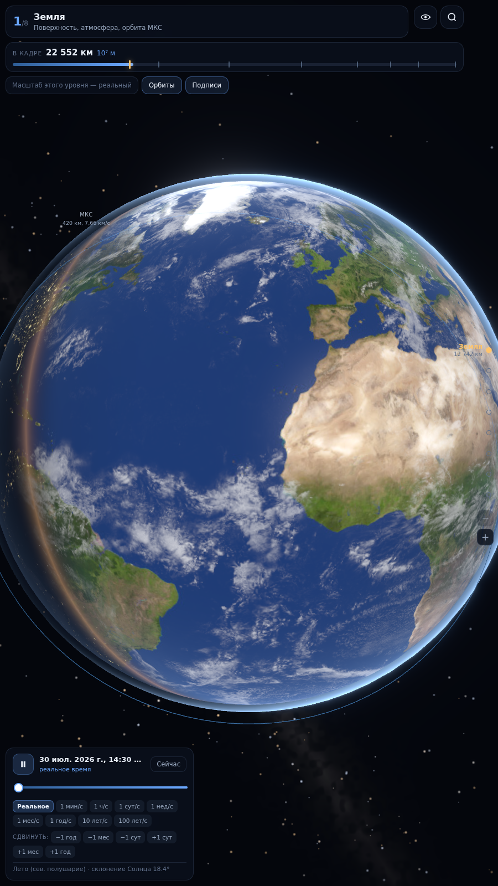

## Уровень 2 — Земля и Луна

Фазы считаются из настоящего взаимного положения. Приливной эллипсоид вытянут
вдоль линии Земля — Луна: отсюда два прилива в сутки. Луна развёрнута к Земле
одной стороной — приливный захват.

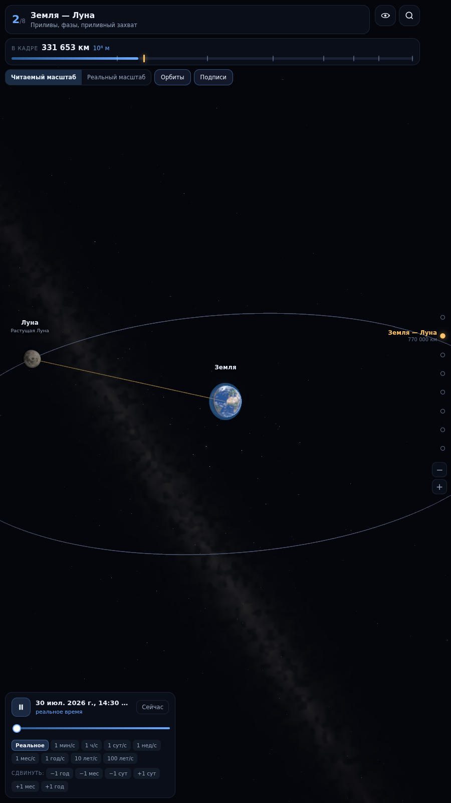

## Уровень 3 — Солнечная система

Положения планет — из приближённых кеплеровых элементов JPL, тех же, по которым
строят реальные эфемериды. Видны щели Кирквуда в поясе астероидов и сгущение
плутино в поясе Койпера.

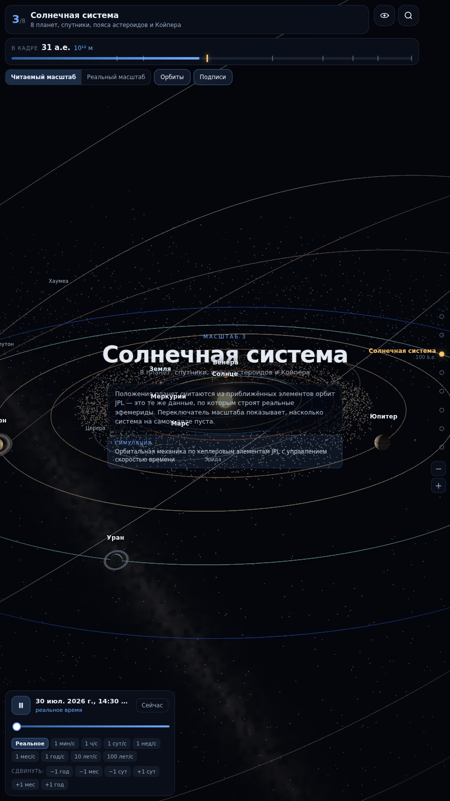

### Переключатель масштаба

В реальном масштабе система выглядит пустой. Это не недоработка — так и есть.

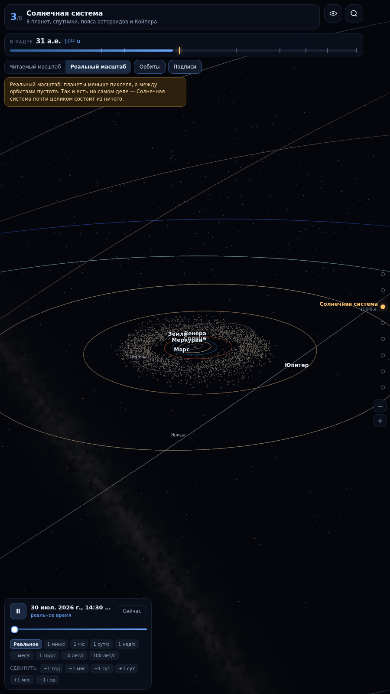

### Панель фактов

У каждого объекта — источник данных. Где изображение художественное, это
сказано прямо.

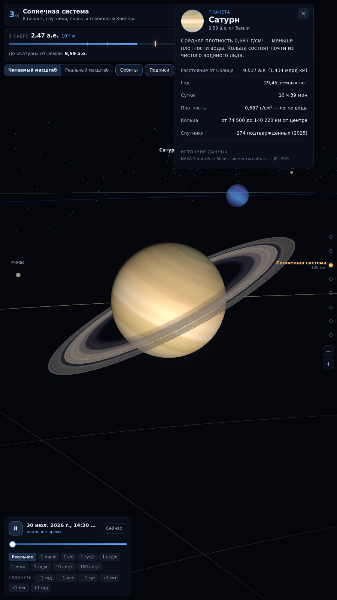

## Уровень 4 — Ближайшие звёзды

Каждая звезда стоит там, где она есть: положение из прямого восхождения,
склонения и измеренного параллакса (Gaia DR3 / RECONS). Цвет — из температуры
по спектральному классу, размер кодирует светимость.

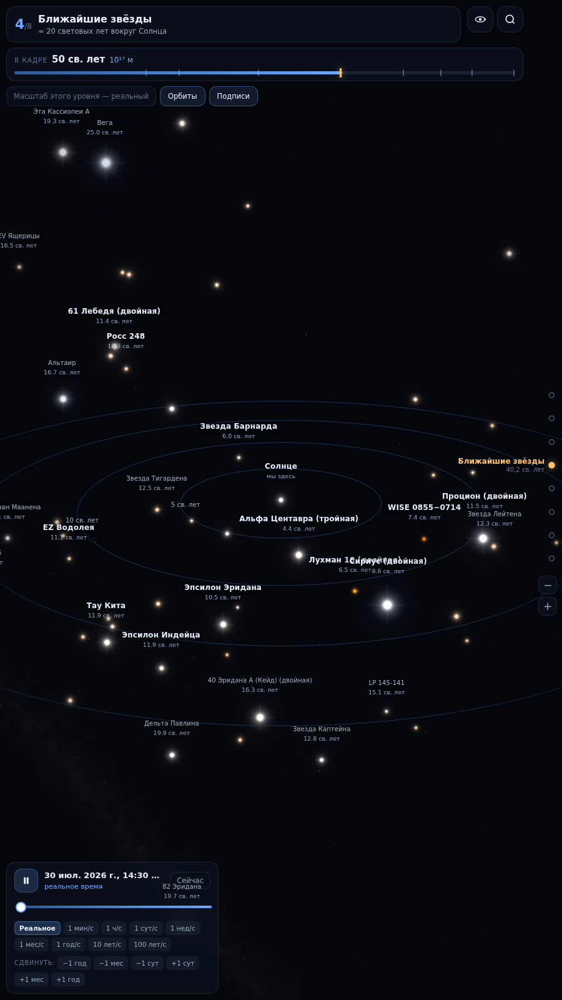

## Уровень 5 — Млечный Путь

Рукава — логарифмические спирали с углами закрутки, измеренными по
VLBA-параллаксам областей звездообразования (Reid et al. 2019). Sgr A*,
шаровые скопления и туманности — на своих галактических координатах.

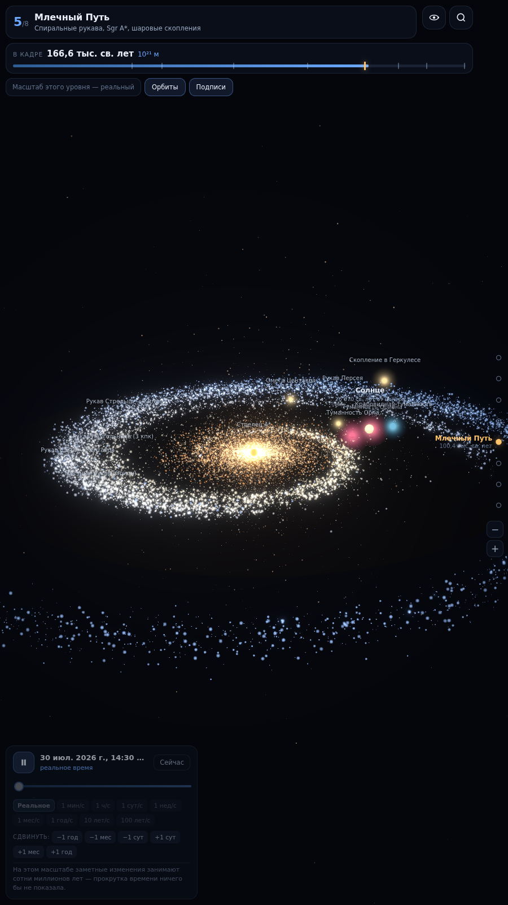

## Уровень 6 — Местная группа

Реальные трёхмерные положения 30 галактик. Вид самих галактик — процедурная
реконструкция по морфологическому типу.

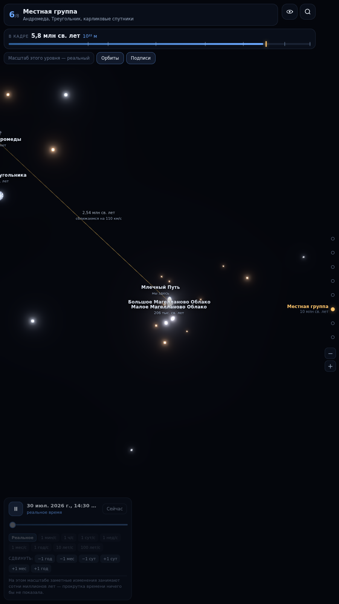

## Уровень 7 — Ланиакея

Узлы — настоящие скопления из каталогов Abell и NED. Нити между ними
достроены процедурно: готовых трёхмерных моделей сверхскоплений не существует.

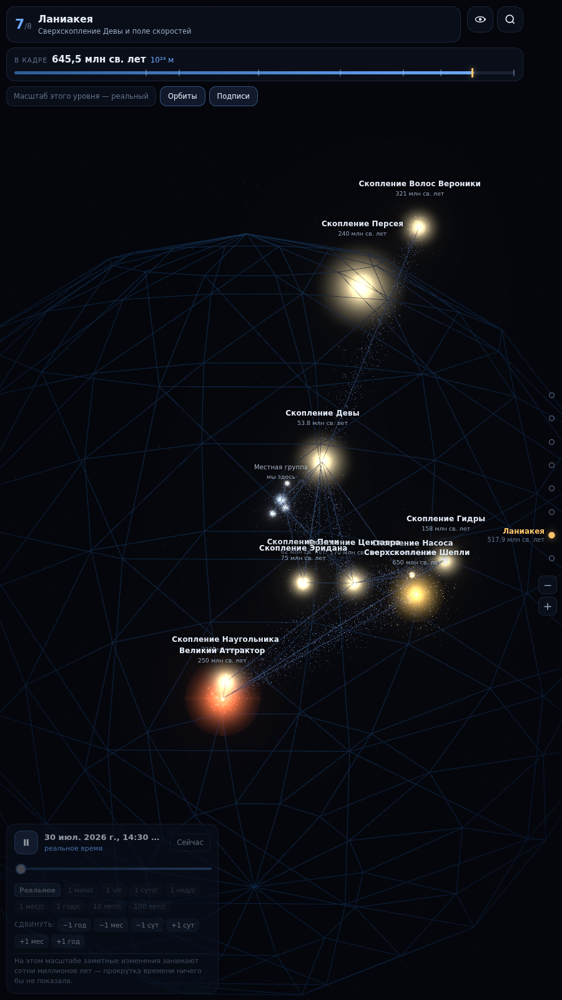

## Уровень 8 — Наблюдаемая Вселенная

Размеры настоящие: сопутствующий радиус 46,5 млрд световых лет, оболочка
реликтового излучения на z ≈ 1090. Космическая паутина сгенерирована по
наблюдаемой статистике — размеру войдов и длине корреляции скучивания.

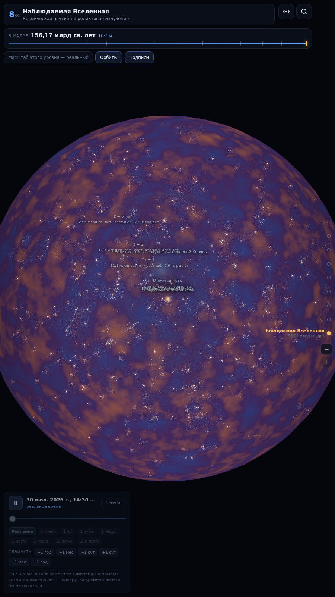

## Поиск

По всем уровням сразу: русское и английское название, каталожное обозначение.
Переход сразу переключает масштаб и наводит камеру.

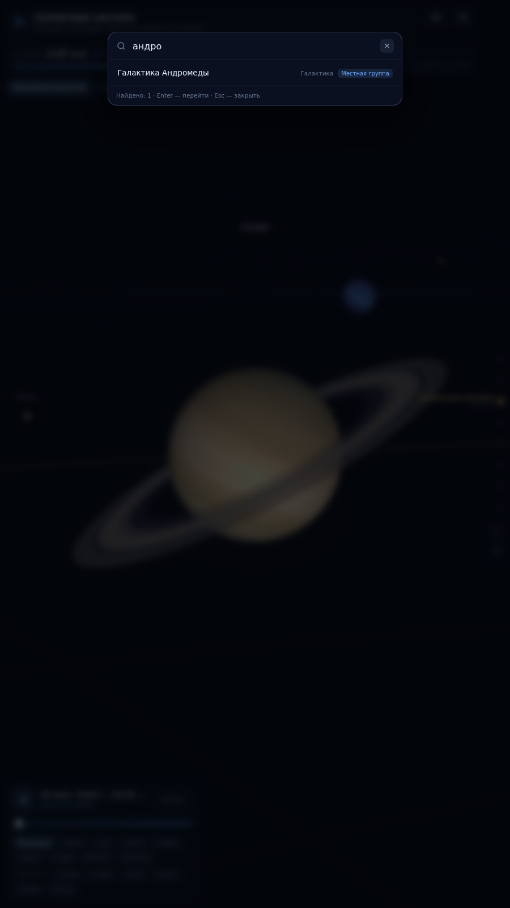

## Гравитационная песочница

Прямое интегрирование задачи N тел методом leapfrog. Дрейф полной энергии
показан в интерфейсе: на устойчивых сценариях он не превышает 0,02 % —
это и есть доказательство, что картинка не артефакт метода.

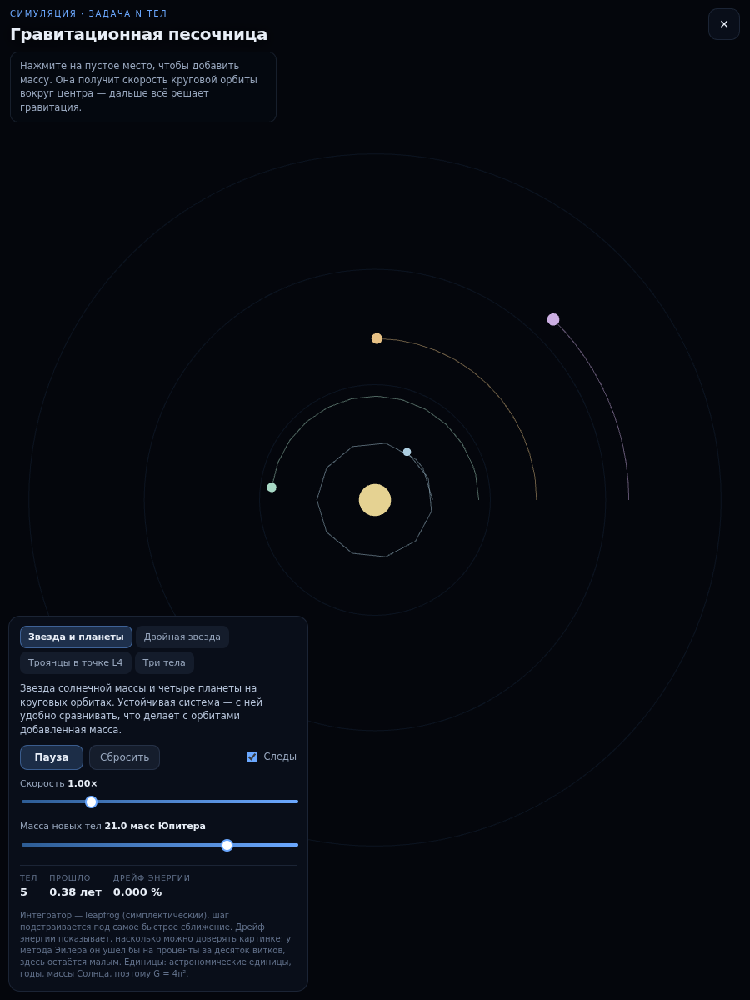

Четыре сценария: звезда с планетами, циркумбинарная планета вокруг двойной
звезды, троянцы в точке L4 и задача трёх тел. Массу можно добавить касанием —
она получает скорость круговой орбиты для массы, заключённой внутри её радиуса.

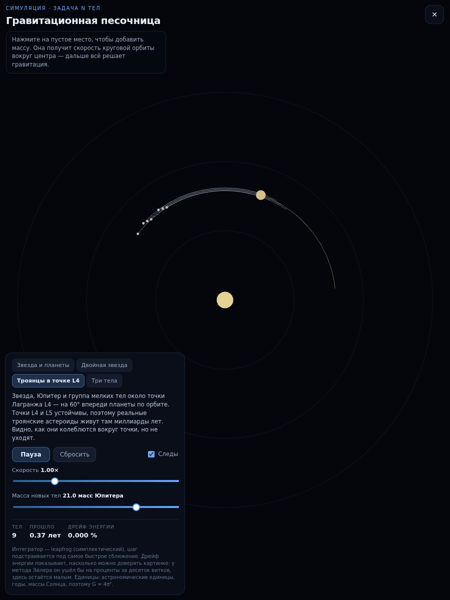
